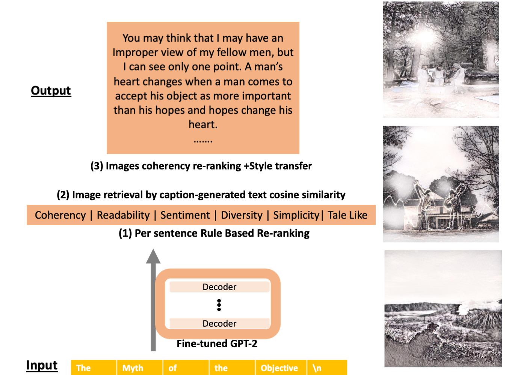

# [FairyTailor](http://fairytailor.org/): Multimodal Generative Framework for Storytelling

### Human-in-the-loop visual story co-creation. 

Users can create a cohesive children's story by weaving generated texts and retrieved images with their input. 
With co-creation, writers contribute their creative thinking, while generative models contribute to their constant workflow. 
FairyTailor adds another modality and modifies the text generation process to help producing a coherent and creative story. 



## Set-up (development)

After cloning the repository:

### Client ([Vue 2.6](https://vuejs.org/))


Install and check that the client compiles:
```
cd client
npm i
npm run build
```

### Backend ([FASTAPI](https://fastapi.tiangolo.com/))

Install and activate the environment (conda provided):
```
conda env create -f environment.yml
conda activate MultiModalStory
```

Install environment globally in the directory: 
```
pip install -e .
```

After installation run:
```
python -m spacy download en_core_web_sm
```
In python terminal:
```
nltk.download('wordnet')
nltk.download('sentiwordnet')
nltk.download('averaged_perceptron_tagger')
```

### Large Data Management ([dvc](https://dvc.org/))

Our large data files are stored on IBM's Cloud Object Storage, and to pull data files from that platform you will use a special, read-only `.dvc/config` file.

```
dvc pull -f
```

Which will pull:
- backend/outputs (five preset stories)
- backend/story_generator/downloaded (transformers)
- client/public/unsplash25k (styled images)

### Running the framework during developemnt

Client: 
```
cd client
npm run serve
```

Backend (with server auto reload): 
```
uvicorn backend.server:app --reload
```


## Modifications Ideas:

### New huggingface transformer
- Place the transformer in `backend/story_generator/downloaded directory`.
- Update the current model path by changing the constant `FINETUNED_GPT2_PATH` in `backend/story_generator/constants.py`.
### New images folder
- Replace the folder `client/public/unsplash25k/sketch_images1024` with yours.
- Update the current path by changing the constant `IMAGE_PATH` in `client/src/components/Constants.js`.
### API functionalities
- Add functions to the backend endpoint at `backend/server/main.py`.
- Update `client/src/js/api/mainApi.js` to call the backend endpoint from the client.
- Update the corresponding user components in `client/src/components`.

